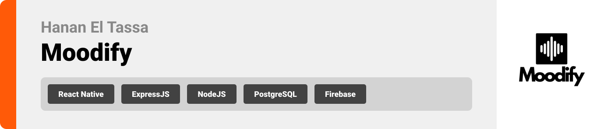

<br><br>

<!-- project philosophy -->


> **Moodify** is a mobile application designed to enhance user well-being through personalized music recommendations based on emotional states and activities.
>
>
> By leveraging AI-driven mood analysis, Moodify creates tailored playlists, offers actionable insights, and provides emotional support through an interactive AI coach. The app aims to empower users to improve their mental well-being with seamless music integration.

### User Stories
- As a user, I want to log my mood, so the app can provide personalized music recommendations.
- As a user, I want to access activity-based playlists, so I can find music that matches my current tasks or workouts.
- As a user, I want to interact with an AI coach, so I can receive tips and challenges to enhance my emotional well-being.
- As a user, I want the app to track my mood patterns over time, so I can understand and improve my mental health.

<br><br>
<!-- Tech stack -->


###  Moodify is built using the following technologies:

- This project uses the [React Native](https://reactnative.dev/). A cross-platform mobile app development framework that enables a seamless experience for both iOS and Android users.
- For backend services, the app uses [Node.js](https://nodejs.org/) with [Express.js](https://expressjs.com/). Node.js provides a scalable runtime environment, and Express.js is used to handle APIs and backend logic efficiently.
- For persistent storage (database), the app uses [MongoDB](https://www.mongodb.com/). MongoDB is a NoSQL database that stores user data, mood logs, playlists, and activity records.
- For authentication, the app integrates [Firebase Authentication](https://firebase.google.com/docs/auth), enabling secure login with Google and other methods.
- The app follows modern design principles and uses a clean and intuitive user interface for an optimal user experience.
- The app uses the font ["Avenir Next LT Pro"](https://fontsgeek.com/fonts/avenir-next-lt-pro-regular) as its primary font, ensuring a clean and modern design for an intuitive user experience.

<br><br>
<!-- UI UX -->


> We designed Moodify to prioritize user experience, with a clean, intuitive interface for mood tracking, playlist recommendations, and AI interactions.

- Project Figma design [figma](https://www.figma.com/design/jxAPLVYsC8L0ZPUDLYSTmV/Moodify?node-id=0-1&node-type=canvas&t=1C0GiuzVrIbosv6F-0)


### Mockups
| Mood Tracking Screen | Playlist Screen | AI Coach Interaction Screen |
| ---| ---| ---|
|  |  |  |

<br><br>

<!-- Database Design -->


###  Architecting Data Excellence: Innovative Database Design Strategies:

Moodify uses [MongoDB](https://www.mongodb.com/), a NoSQL database, to store and manage all application data efficiently. Below is the structure of the main collections in the database:

- **Users Collection**: Stores user profiles and authentication data (linked with Firebase Authentication).
  - Fields: `userId`, `name`, `email`, `profilePicture`, `preferences`

- **Mood Logs Collection**: Tracks user mood entries along with timestamps and optional activity tags.
  - Fields: `logId`, `userId` (foreign key), `mood`, `activity`, `timestamp`

- **Playlists Collection**: Links mood states and activities to personalized playlists.
  - Fields: `playlistId`, `userId` (foreign key), `mood`, `activity`, `playlistUrl`, `createdAt`

- **AI Interactions Collection**: Logs user interactions with the AI coach, including questions and recommendations.
  - Fields: `interactionId`, `userId` (foreign key), `interactionType`, `content`, `timestamp`

- **Challenges Collection**: Stores personalized challenges provided by the AI coach.
  - Fields: `challengeId`, `userId` (foreign key), `challengeDescription`, `status`, `dueDate`

### ER Diagram

- Insert ER Diagram here


<br><br>


<!-- Implementation -->


### User Screens (Mobile)
| Login screen  | Register screen | Landing screen | Loading screen |
| ---| ---| ---| ---|
|  |  |  |  |
| Home screen  | Menu Screen | Order Screen | Checkout Screen |
|  |  |  |  |

### Admin Screens (Web)
| Login screen  | Register screen |  Landing screen |
| ---| ---| ---|
|  |  |  |
| Home screen  | Menu Screen | Order Screen |
|  |  |  |

<br><br>


<!-- Prompt Engineering -->


###  Mastering AI Interaction: Unveiling the Power of Prompt Engineering:

- This project uses advanced prompt engineering techniques to optimize the interaction with natural language processing models. By skillfully crafting input instructions, we tailor the behavior of the models to achieve precise and efficient language understanding and generation for various tasks and preferences.

<br><br>

<!-- AWS Deployment -->


###  Efficient AI Deployment: Unleashing the Potential with AWS Integration:

- This project leverages AWS deployment strategies to seamlessly integrate and deploy natural language processing models. With a focus on scalability, reliability, and performance, we ensure that AI applications powered by these models deliver robust and responsive solutions for diverse use cases.

<br><br>

<!-- Unit Testing -->


###  Precision in Development: Harnessing the Power of Unit Testing:

- This project employs rigorous unit testing methodologies to ensure the reliability and accuracy of code components. By systematically evaluating individual units of the software, we guarantee a robust foundation, identifying and addressing potential issues early in the development process.

<br><br>


<!-- How to run -->


> To set up Moodify locally, follow these steps:

### Prerequisites

This is an example of how to list things you need to use the software and how to install them.
* npm
  ```sh
  npm install npm@latest -g
  ```

### Installation

_Below is an example of how you can instruct your audience on installing and setting up your app. This template doesn't rely on any external dependencies or services._

1. Get a free API Key at [example](https://example.com)
2. Clone the repo
   git clone [github](https://github.com/hananeltassa/Moodify.git)
3. Install NPM packages
   ```sh
   npm install
   ```
4. Enter your API in `config.js`
   ```js
   const API_KEY = 'ENTER YOUR API';
   ```

Now, you should be able to run Moodify locally and explore its features.